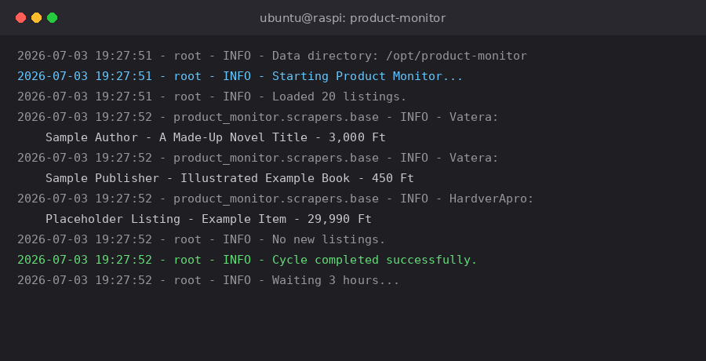

# product-monitor

[](https://github.com/griffffffin/product-monitor/actions/workflows/tests.yml)
[](LICENSE)
[](pyproject.toml)

An asyncio-based Python scraper that watches four Hungarian secondhand marketplaces for specific products under a price ceiling, and emails a summary whenever something new shows up or an existing listing drops in price.

## Why this exists

I wanted to know the moment a specific used Xbox Series S, a particular laptop cooler, or a handful of out-of-print psychology/pedagogy textbooks turned up for sale somewhere in Hungary, without manually refreshing four different marketplace sites. This runs unattended on a Raspberry Pi via systemd and only emails when there's actually something worth looking at. It's the sibling project of [house-monitor](https://github.com/griffffffin/house-monitor) — same author, same Raspberry Pi, same Gmail account for notifications.

## What it does

- Scrapes 4 independent Hungarian marketplace sites — HardverApro, Vatera, Jófogás, and Moly (a books-specific marketplace) — each with its own page structure behind one common interface
- Filters by a per-search price ceiling and (optionally) search terms
- Detects both **new** listings and **price changes** on listings it's already seen
- Sends a single, grouped-by-site email per check cycle (every 3 hours by default) via Gmail SMTP
- Persists seen listings to a local JSON file: batch-written, atomically replaced, with a `/tmp` fallback location if the primary data directory isn't writable
- Checks its own scrapers once a day against the live sites (see [Self-check](#self-check-catching-a-silent-break)) and emails **only** when one is actually broken

## What it doesn't do (honest limitations)

- No cross-platform duplicate detection: the same item listed on two sites triggers two separate emails, not one merged one.
- `matches_search_terms` does plain substring matching, not word-boundary matching — a single-letter search term like `"s"` would match almost anything containing that letter (e.g. "Xbox Series X" as well as "Series S"). This is a deliberately accepted looseness, not a bug — it's covered explicitly in `tests/test_parsing.py`, along with the trick of using one combined phrase term (e.g. `"series s"` instead of `"series"` + `"s"`) to get word-boundary-like precision back without any code change.
- Moly requires hand-picking the exact URL of each book you want to watch; there's no keyword search across Moly's whole catalog.
- The unit tests run against static, hand-built fixtures — they verify parsing logic against a known structure, but by themselves they cannot catch a live site changing its markup out from under a scraper. That's not hypothetical: see the live smoke check section below.
- See `CLAUDE.md` for the current status of the quality pass this project is going through.

## Language note

Code, comments, and this README are in English. Log messages, exception text, and the notification emails themselves are in Hungarian — this is a personal tool for a Hungarian-speaking owner watching Hungarian marketplaces, and the emails need to be readable at a glance, not mentally translated first.

## Running it

```bash
pip install -r requirements.txt
```

(or `pip install .` / `pip install -e .` — the project has proper `pyproject.toml` packaging metadata and exposes a `product-monitor` console script; production on the Pi doesn't pip-install either way, the systemd unit just invokes `python3 -m product_monitor.main` directly against the deployed package)

Set the following environment variables (see `.env.example`):

```
SMTP_SERVER=smtp.gmail.com
SMTP_PORT=587
SENDER_EMAIL=you@example.com
SENDER_PASSWORD=your-app-password
RECIPIENT_EMAIL=you@example.com
```

Copy `product-monitor-config.example.json` to `product-monitor-config.json` and fill in what you actually want to watch:

```json
{
  "searches": [
    { "site": "Vatera", "search_terms": ["example", "product"], "max_price": 15000 }
  ],
  "check_interval": 10800,
  "cleanup_days": 60
}
```

Then:

```bash
python3 -m product_monitor.main
```

(or just `product-monitor`, if installed via `pip install .`/`pip install -e .`)

It runs forever (a `while` loop with an interruptible sleep between cycles) until it receives `SIGTERM`/`SIGINT` — in production that's a systemd service, see `CLAUDE.md` for the unit file.

## Sample output

Console output from a manual run - the format/timing is real (captured from an actual single-cycle run of the `product_monitor` package against the live sites, using a generic `"könyv"` (book) search term, not the owner's real configured searches, which are personal). Unlike house-monitor, product-monitor doesn't have a separate compact/`NOTICE`-level console format - a manual run prints the same full-detail lines you'd find in the log file. The real log messages are in Hungarian (see the Language note above); this image shows them translated to English for readability. The individual listing titles are placeholder/illustrative, not real sellers' listings - this project doesn't publish real scraped third-party content in its docs. Note the logger name (`product_monitor.scrapers.base`) reflects the real package structure, not a flat single-file layout:



The email itself is grouped by site. The real emails are in Hungarian (the owner's language) - this is the same layout translated to English:

```
==============    Vatera (2 listings)    ==============

1. Sample Author - A Made-Up Novel Title
   Price: 3,000 Ft
   Link: https://www.vatera.hu/...

2. Sample Publisher - Illustrated Example Book
   Price: 450 Ft
   Link: https://www.vatera.hu/...
```

## Tests

```bash
python3 -m pytest tests/ -v
```

65 unit tests, no network calls or real email sends — price parsing, text normalization/matching, one dedicated fixture-based parsing test per site (all 4), dedup/cleanup/save-load round-tripping, email body formatting, and the daily self-check's failure/no-failure logic and once-a-day scheduling.

### Self-check: catching a silent break

A scraper that breaks doesn't crash — it just quietly returns nothing, forever, which looks exactly like a quiet market. So the running service checks itself: in the first cycle at or after `health_check_hour` (16:00 by default), it hits every site and verifies its scraper still finds listing cards there.

It emails you **only when something is actually wrong**:

| Result | Means | Email? |
| --- | --- | --- |
| Fetch/parse error | The site is unreachable, blocking, or erroring | Yes |
| 0 raw cards | The page loaded but no listings were found — selectors likely dead | Yes |
| 0 matches, raw cards fine | Nothing for sale right now — the normal quiet state | **No** |

That last row is the whole point: a zero-results day is not an incident, and getting an email about it every evening would train you to ignore the ones that matter. Configure with `health_check_enabled` / `health_check_hour`, or run the same check by hand at any time:

### Live smoke check

```bash
python3 scripts/live_smoke_check.py
```

Runs all 4 scrapers for real, against the live sites, with no price/term filtering beyond a generic sanity search, and no email/database side effects. Reports a raw-card count and a matched count per site, so a broken selector (raw count drops to 0) is distinguishable from "genuinely nothing in stock right now" (matched count is 0 but raw isn't). Exits non-zero on a real failure. This is the same code the daily self-check above runs (`product_monitor/health_check.py`) — a bug in one can't hide a bug in the other.

Note on CI: the weekly scheduled run of this check happens on GitHub's hosted runners, whose IP ranges some of these sites block outright (a red run has already been a false alarm twice, with all 4 sites healthy from a home connection minutes later). Treat a failure there as a prompt to run the check yourself, not as proof of a break. The in-service daily self-check runs from the same network as the real scraper, so it doesn't have this problem — which is precisely why it exists.

This isn't a theoretical safeguard. In July 2026, jofogas.hu was rebuilt on a Next.js/React frontend, and the scraper's DOM selectors (`div.general-item`, `id="listid_*"`) stopped matching anything — silently. No exception, no error log, just permanently zero Jofogas results every cycle, for an unknown length of time. The static-fixture unit tests didn't catch it (the fixtures still matched the *old* structure they were written against); only running the live smoke check against the real site did. The fix — parsing the `__NEXT_DATA__` JSON blob the page now embeds its listing data in, instead of scraping the DOM — is in `product_monitor/scrapers/jofogas.py`; the incident is written up in full in `CLAUDE.md`.

### Dev tooling

```bash
pip install -r requirements-dev.txt
black product_monitor/ tests/ scripts/
ruff check product_monitor/ tests/ scripts/
mypy product_monitor/
```

...or via the `Makefile`:

```bash
make install-dev
make check   # test + lint + typecheck + format --check, all in one go
```

CI runs the test suite against Python 3.11, 3.12, and 3.13, plus a separate lint job (formatting/lint/type-check). A second workflow runs the live smoke check on a weekly schedule (and on demand from the Actions tab), so a silent site redesign like the Jofogas one above gets caught automatically, not just whenever someone happens to run it by hand.

Optionally, install the [pre-commit](https://pre-commit.com/) hooks to run the same checks automatically before every commit, instead of only in CI:

```bash
pip install pre-commit
pre-commit install
```

Dependency updates (both Python packages and the CI workflow's own actions) are handled by [Dependabot](.github/dependabot.yml), which opens a PR automatically on a weekly schedule. These are reviewed manually, never auto-merged: a green CI run only proves the network-free unit tests still pass, not that the real scrapers still work against the live sites — any `aiohttp`/`beautifulsoup4`/other network-facing bump gets a `scripts/live_smoke_check.py` run first.

## Architecture

Split into a package (as of the 2026-07-03 modularization — originally a single ~1000-line script, `product-monitor.py`, the way house-monitor used to be):

```
product_monitor/
├── __init__.py          — re-exports the public API (SearchConfig, Advertisement, MonitorConfig, the scrapers, MultiMarketplaceMonitor, EMAIL_CONFIG)
├── config.py             — EMAIL_CONFIG (env-var-driven), LOG_FILE
├── models.py              — SearchConfig / Advertisement / MonitorConfig dataclasses
├── email_notifier.py      — EmailNotifier (Gmail SMTP, sent from a thread pool so it doesn't block the event loop)
├── scrapers/
│   ├── base.py             — BaseScraper (normalize_text/parse_price/matches_search_terms/create_advertisement, shared by all 4 sites)
│   ├── hardverapro.py, moly.py, vatera.py, jofogas.py — one file per site, each implements build_search_url() and process_ad_item()/fetch_advertisements()
│   └── __init__.py          — re-exports all 5 classes
├── health_check.py         — the live self-check: hits every site, tells a broken scraper apart from an empty market (used by both the daily in-service check and scripts/live_smoke_check.py)
├── monitor.py              — MultiMarketplaceMonitor: loads config, runs all configured searches concurrently (bounded by a semaphore), dedupes against the seen-ads JSON file, sends one grouped notification email, cleans up old entries, runs the daily self-check, sleeps until the next cycle
└── main.py                  — entry point (`product_monitor.main:main`, also exposed as the `product-monitor` console script if installed)

tests/                    — 65 unit tests, no network calls (see Tests above)
scripts/                  — live_smoke_check.py, the manual/CI entry point to health_check.py
```

## A note on how this was built

This project was developed with heavy use of [Claude Code](https://claude.com/claude-code) as a pair-programming tool — the `.claude/` directory and `CLAUDE.md` in this repo are left in intentionally, as a record of that workflow.
